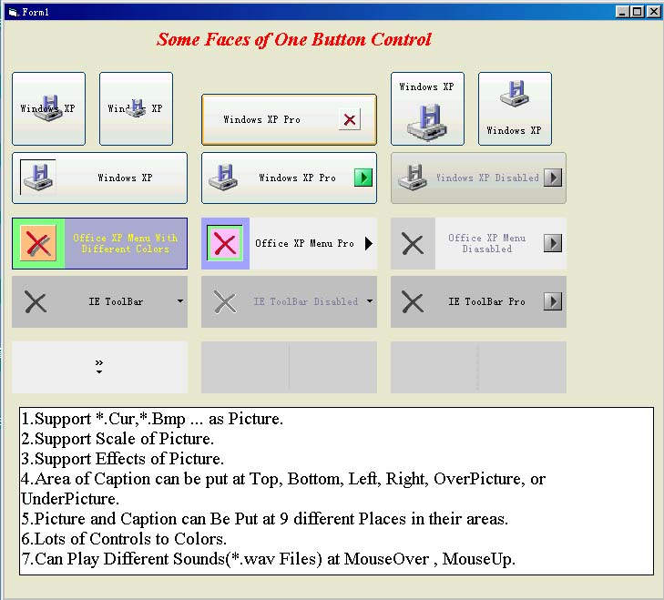

## HzxY Button English Version

### Description

WindowsXP-like CommandButton, Or OfficeXP-like MenuButton, Or IE6 ToolBarButton, 6 Caption Area positions relate to Picture Area, 9 Caption positions in Caption Area, plus 9 Picture positions in Picture Area, add one picture in AddIn-Area, powerful control of Colors and image effects.

NO Timer , NO ImageBox, NO Label, that is HzxY Button.

This is a English version. If you don't understand Chinese, you can try this version I've Uploaded.

BTW, I've uploaded my article to introduce my control. If you have puzzles in using HzxYButton, you can refer to my introduction.
 
### More Info
 

             |
---                |---
**Submitted On**   |2002-12-07 02:49:12
**By**             |[Yin Huang](https://github.com/Planet-Source-Code/PSCIndex/blob/master/ByAuthor/yin-huang.md)
**Level**          |Beginner
**User Rating**    |4.7 (14 globes from 3 users)
**Compatibility**  |VB 6\.0
**Category**       |[Custom Controls/ Forms/  Menus](https://github.com/Planet-Source-Code/PSCIndex/blob/master/ByCategory/custom-controls-forms-menus__1-4.md)
**World**          |[Visual Basic](https://github.com/Planet-Source-Code/PSCIndex/blob/master/ByWorld/visual-basic.md)
**Archive File**   |[HzxYButton1508911262002\.zip](https://github.com/Planet-Source-Code/yin-huang-hzxy-button-english-version__1-41358/archive/master.zip)

